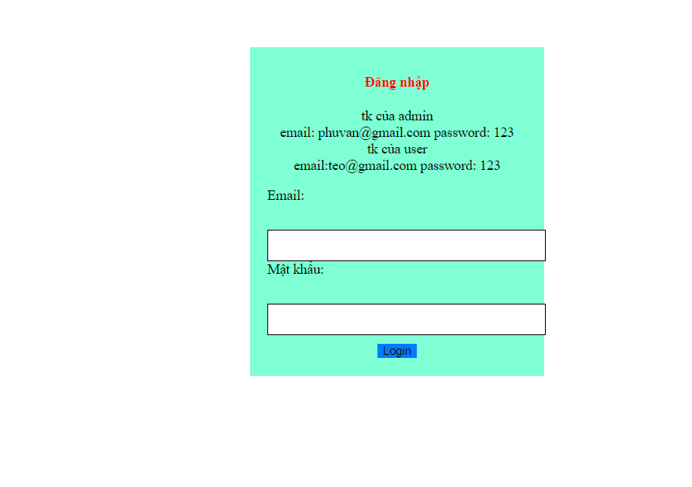
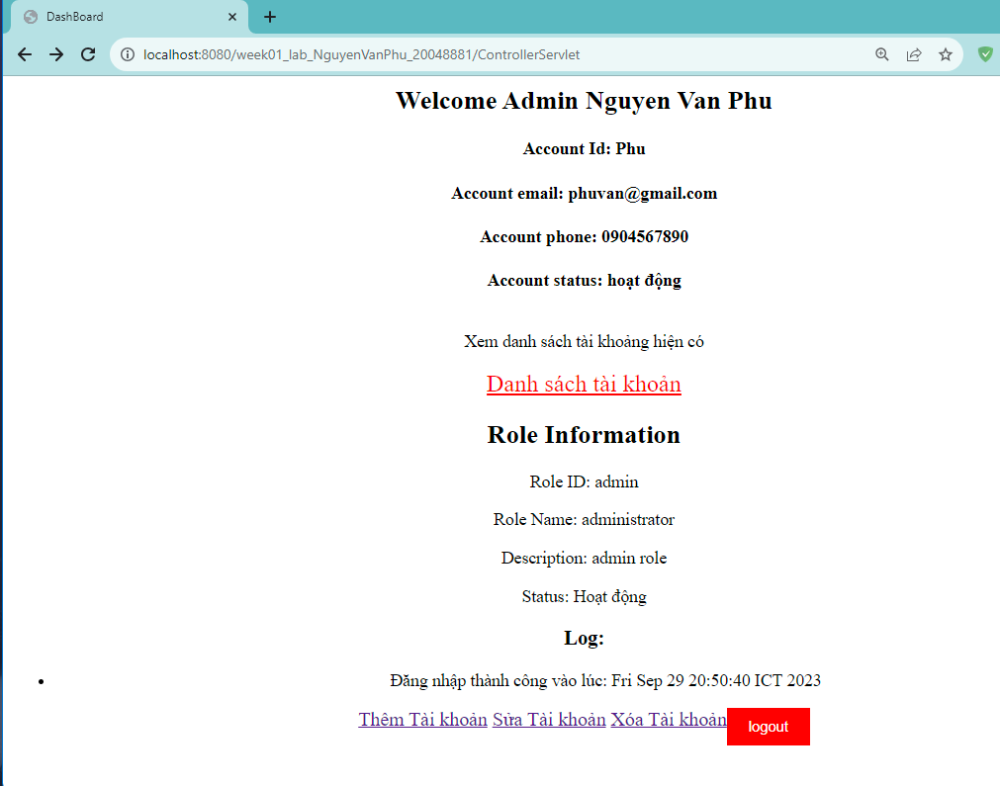
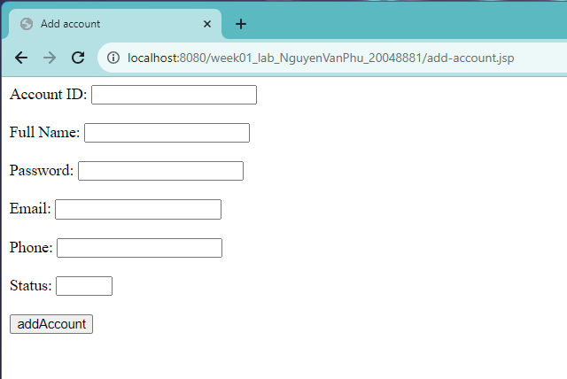
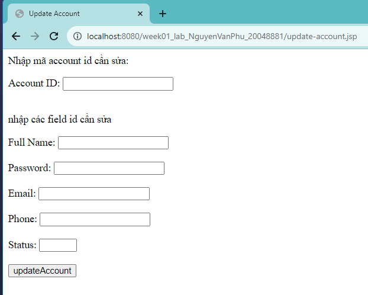
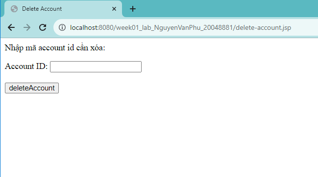
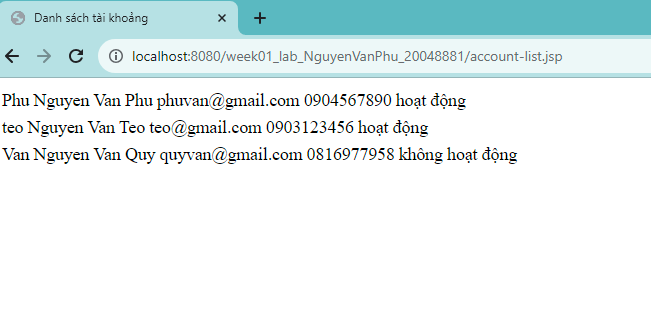
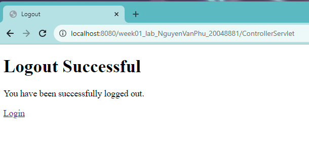
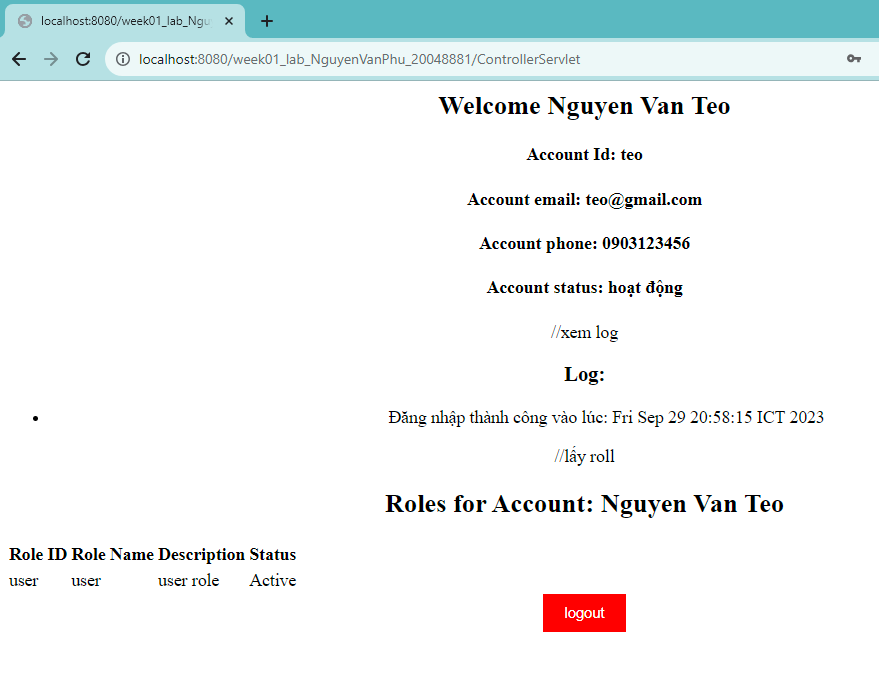

# week01_lab_NguyenVanPhu_20048881
thực hành WWW, tuần 01

Mô tả: Trang html hiển thị cửa sổ đăng nhập với 2 trường email và password,
đăng nhập thành công là quyền admin sẽ dẫn tới cửa sổ dashboard admin,
và còn lại dẫn tới cửa sổ dashboard user

### Admin
Sau khi đăng nhập xong, trong cửa sổ dashboard admin sẽ hiển thị 
log đăng nhập thành công vào lúc thời gian nào, 

các chức năng trong trang:
+ Ghi log mỗi lần account đăng nhập, đăng xuất
+ Hiển thị thông tin tài khoản (nếu đăng nhập thành công)
+ Thêm bảng đã cho.

+ sửa bãng đã cho 

+ xóa bảng đã cho
+ 
+ Hiển thị các quyền của một account 
+ Hiển thị các account của một role được lấy lên từ cơ sở dữ liệu

+Đăng xuất sau khi bấm vào sẽ dẫn đến trang thông báo

### User
Sau khi đăng nhập xong, trong cửa sổ dashboard user sẽ hiển thị
log đăng nhập thành công vào lúc thời gian nào, 

+ Ghi log mỗi lần account đăng nhập, đăng xuất
+ Hiển thị thông tin tài khoản (nếu đăng nhập thành công)
+ Hiển thị các quyền của một account
+ đăng xuất 